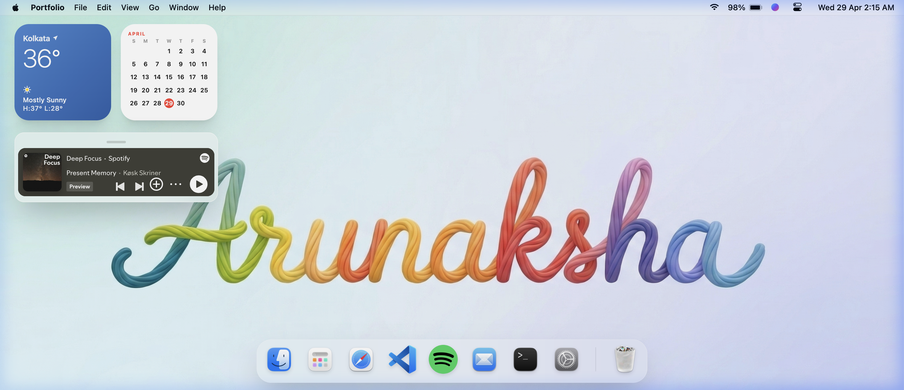
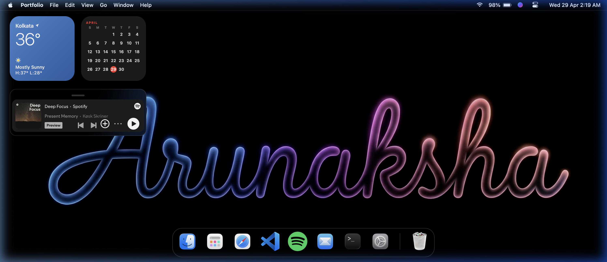
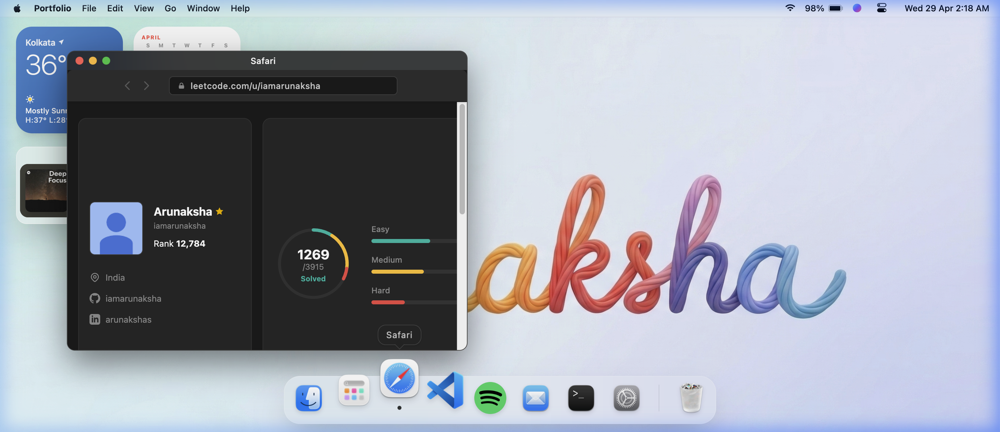
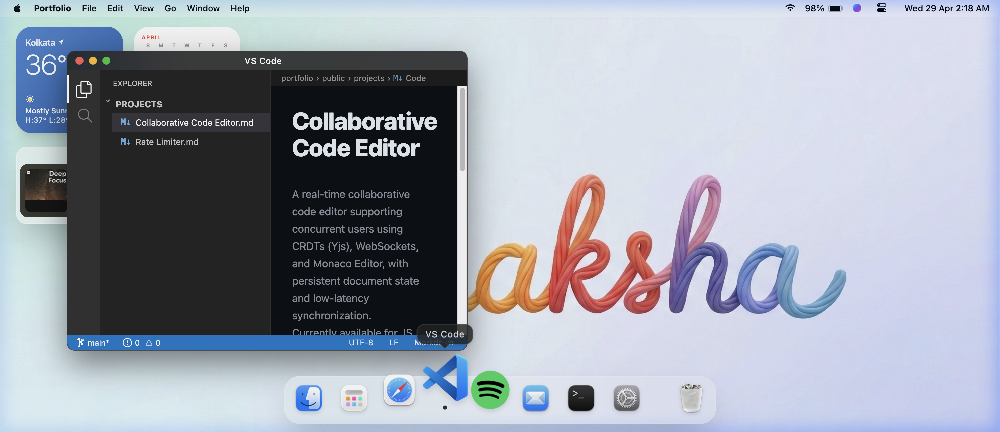

<div align="center">

# 🍎 Arunaksha's Portfolio

**A macOS-inspired interactive portfolio that runs entirely in your browser.**

[](https://iamarunaksha.github.io/Personal-Portfolio)
[](https://github.com/iamarunaksha)
[](https://linkedin.com/in/arunakshas)

</div>

---

## ✨ What is this?

This isn't your typical developer portfolio. Instead of a standard webpage with sections and scroll animations, I built a **fully functional macOS desktop** — complete with a menu bar, dock, draggable windows, and working apps — all inside the browser.

Every "app" you open reveals a different part of my story: my projects, my LeetCode journey, my experience, even my Spotify playlist. It's the kind of portfolio I'd actually enjoy browsing myself.

<div align="center">


*Light mode desktop with weather widget, calendar, and Spotify mini-player*

</div>

---

## 🖥️ Features at a Glance

| Feature | What it does |
|---|---|
| **🍏 Boot Sequence** | A cinematic macOS-style boot animation plays when you first visit the site |
| **🎨 Light / Dark / Auto** | Full theme support — switch between light mode, dark mode, or follow your system preference |
| **📂 Finder** | Browse my experience, education, and resume — laid out like actual Finder folders |
| **💻 VS Code** | Read about my projects in a pixel-perfect VS Code replica with a file explorer sidebar |
| **🌐 Safari** | View my live LeetCode stats pulled from the actual API, with a monthly badge tracker |
| **🎵 Spotify** | An embedded Spotify player with my "Deep Focus" coding playlist |
| **📧 Mail** | A welcome email from me, styled like Apple Mail |
| **⌨️ Terminal** | A working terminal with commands like `about`, `skills`, `projects`, and `help` |
| **⚙️ Settings** | Toggle themes with wallpaper previews |
| **🚀 Launchpad** | A tech stack grid showing all the tools I work with |
| **🗑️ Trash** | Open it. There are easter eggs. |

---

## 🌙 Dark Mode

The entire interface adapts — wallpaper, menu bar, dock, window chrome, and all app content switch seamlessly.

<div align="center">


*Dark mode with the glowing neon wallpaper*

</div>

---

## 📸 App Previews

<div align="center">

| Safari — LeetCode Stats | VS Code — Projects |
|---|---|
|  |  |
| *Live stats from the LeetCode API with monthly badge tracking* | *Project details rendered as markdown files in a VS Code-style editor* |

</div>

---

## 🛠️ Built With

- **React 19** — Component architecture and state management
- **Vite** — Lightning-fast dev server and build tool
- **TailwindCSS v4** — Utility-first styling with the new Vite plugin
- **Vanilla JavaScript** — Window management, drag & drop, dock animations
- **LeetCode API** — Live problem-solving stats
- **Spotify Embed** — Actual playback integration
- **GitHub Pages** — Hosting via the `gh-pages` branch

---

## 🚀 Getting Started

### Prerequisites

- **Node.js** (v18 or later)
- **npm** (v9 or later)

### Run locally

```bash
# Clone the repository
git clone https://github.com/iamarunaksha/Personal-Portfolio.git
cd Personal-Portfolio

# Install dependencies
npm install

# Start the dev server
npm run dev
```

The site will be live at `http://localhost:5173/Personal-Portfolio/`

### Deploy to GitHub Pages

```bash
# Build + deploy in one command
npm run deploy
```

This builds the production bundle and pushes it to the `gh-pages` branch automatically.

---

## 📁 Project Structure

```
Portfolio/
├── public/
│   ├── boot/              # Boot animation & wallpaper images
│   ├── dock-icons/         # Dock app icons
│   ├── leetcode-icons/     # Monthly LeetCode badge icons
│   ├── projects/           # Project screenshot thumbnails
│   └── face.png            # Profile photo
├── src/
│   ├── Components/
│   │   ├── Apps/           # Individual app components (Safari, VSCode, etc.)
│   │   ├── Bootscreen.jsx  # Boot animation sequence
│   │   └── Desktop.jsx     # Main desktop — dock, menu bar, window manager
│   ├── config/
│   │   └── portfolioData.js  # All personal data in one config file
│   ├── App.jsx             # Root component with theme logic
│   └── index.css           # Global styles & Tailwind imports
├── vite.config.js
└── package.json
```

---

## 🎯 Make It Your Own

Want to use this as your own portfolio? Everything personal is stored in a single file:

**`src/config/portfolioData.js`**

Just update the name, links, projects, experience, and skills — and the entire portfolio adapts. No need to dig through component files.

---

## 📬 Get in Touch

If you liked this project or want to collaborate, feel free to reach out:

- **Email:** [sarkararunaksha22@gmail.com](mailto:sarkararunaksha22@gmail.com)
- **LinkedIn:** [arunakshas](https://linkedin.com/in/arunakshas)
- **GitHub:** [iamarunaksha](https://github.com/iamarunaksha)

Or just open the **Mail** app in the portfolio 😄

---

<div align="center">

Made with ☕ and way too many late nights.

</div>
